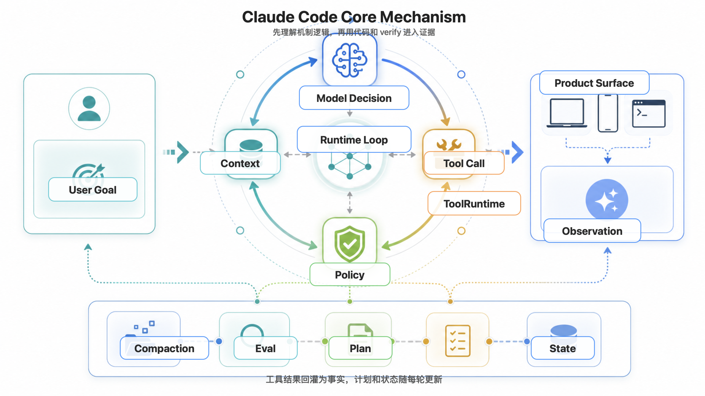

# Claude Code Core Lab

[](https://github.com/boyzcl/claude-code-core-lab/actions/workflows/verify.yml)

这是一个中文学习项目：围绕 Claude Code 这类代码智能体的核心机制，从零搭一个可运行、可验证、可复盘的本地核心运行时。

你可以把它理解成一套“先看懂机制逻辑，再用课程、实验和验证深入”的学习项目：

```text
先理解 Claude Code-like Agent 的完整逻辑链路
再看 Runtime / Context / Tool / Policy / Eval 分别负责什么
再进入 Course / Lab / Core 深入学习
最后用 verify 证据确认每一步到底成立了什么
```

为了让项目能公开学习和长期维护，本仓库不复制 Claude Code 官方源码、私有提示词或非公开实现。它学习的是 Claude Code 暴露出来的产品问题和代码智能体运行时设计方法，并用我们自己写的代码和评测来复现核心闭环。

## 30 秒机制图



这张图的读法很简单：用户目标进入运行时循环；上下文决定模型本轮能看见什么；模型提出工具意图；策略和工具运行时负责真正执行；观察结果回灌为状态、计划、压缩和评测证据；产品表层把这些边界变成用户能理解和控制的体验。

第一次理解项目时，先读 [Claude Code-like Agent 核心逻辑总览](docs/core-logic-map.md)。Course / Lab / Core 仍然保留，但它们是深入学习材料，不是首页第一理解负担。官方能力如何映射到本项目，见 [Claude Code 官方能力覆盖矩阵](docs/reference/claude-code-capability-coverage-matrix.md)。

## 你会学到什么

学完后，你应该能用自己的话解释并动手验证：

- 模型第一次被调用时，到底看见哪些消息、工具、状态和规则。
- 工具为什么必须由运行时执行，而不是靠提示词口头授权。
- 上下文如何组装、裁剪、附件化，以及为什么有些内容可以稳定复用。
- 计划为什么是状态机，不是模型写的一段计划文本。
- 压缩为什么不是普通摘要，而是任务状态保真。
- 评测如何把“能力变强了”变成可运行证据。
- 参考智能体、成本估算、相对分数为什么都有严格证据门槛。
- Core 18-26 为什么是一条生产化升级证据链，而不是九个散功能。
- Core 27 如何把设置 / 权限规则（settings / permission rules）解析成工具执行前的允许 / 询问 / 拒绝（allow / ask / deny）。
- Core 28 如何把钩子（hooks）作为运行时生命周期事件（Runtime lifecycle event）处理，而不是把外部反馈伪装成系统提示词（system prompt）。
- Core 29 如何把 `CLAUDE.md`、用户记忆 / 反馈记忆 / 参考记忆（user / feedback / reference memory）变成可索引、可删除、可重新验证的上下文来源。
- Core 30 如何把检查点 / 回退（checkpoint / rewind）变成绑定文件指纹（hash）、会话事件（session event）和审计回放（audit replay）的恢复边界。
- Core 31 如何把子代理（subagent）变成委派任务（delegated task）、隔离上下文、结构化回传和去重账本（ledger）。

## 适合谁

- 想系统理解 Claude Code / 代码智能体工作机制的学习者。
- 想从零实现一个本地代码智能体运行时的工程师。
- 想学习代码智能体产品如何做上下文、工具、权限策略、计划和评测的开发者。
- 想把 AI Coding 项目做成可验证、可教学、可开源项目的人。

不适合把它当成：

- Claude Code 官方源码。
- Claude Code 完整复刻。
- 可直接替代 Claude Code 的生产级产品。
- 真实厂商账单、真实 Claude Code 基线（baseline）或跨智能体相对分数（Agent RelativeScore）。

## 你会得到什么结果

看懂并验证后，预期结果不是“得到一个 Claude Code 替代品”，而是：

- 你能在本地运行一套最小代码智能体核心。
- 你能读懂一次任务从用户输入、上下文组装、工具执行、计划更新到最终验证的链路。
- 你能用 `npm run core:*:verify` 证明某个机制到底成立了什么。
- 你能分清“本地确定性证据”和“真实生产能力声明”的差别。

## 推荐学习路线

第一次打开仓库，按这个顺序来：

1. 读 [核心逻辑总览](docs/core-logic-map.md)，先理解完整机制链路。
2. 读 [学习者入口](docs/start-here-for-learners.md)，选择适合你的学习方式。
3. 按 [从零学习计划（Learning Plan）](docs/learning-plan.md) 选择 30 分钟、半天或七节主线学习法。
4. 读 [课程路线](docs/course/claude-code-core-learning-path.md)，知道 course -> lab -> core 为什么这样排。
5. 从 [Course 00](docs/course/course-00-teaching-standard.md) 开始顺序读到 [Course 18](docs/course/course-18-product-surface-implementation-chain.md)。
6. 每读完一组机制，再运行对应 Lab 或 Core 验证脚本，把 verify 当作证据入口。
7. 不懂英文术语时，看 [中文术语表](docs/production-upgrade-terms-zh.md)。
8. 想把 31 个 Core 收束成少数对象时，看 [核心运行时对象地图（Core Runtime Object Map）](docs/reference/core-runtime-object-map.md)。
9. 想读一篇完整长文时，看 [代码智能体实现逻辑（Code Agent Implementation Logic）](docs/reference/code-agent-implementation-logic.md)。
10. 想对照官方公开能力时，看 [Claude Code 官方能力覆盖矩阵](docs/reference/claude-code-capability-coverage-matrix.md)。
11. 想动手练习时，从 [练习入口（Exercises）](exercises/README.md) 开始；完成主线后做 [capstone-mini-runtime](projects/capstone-mini-runtime/README.md)。

如果你只是先试水，不需要一上来读完整 19 门课。可以按时间选择：

| 时间 | 推荐路径 |
| --- | --- |
| 30 分钟 | 读 README、核心逻辑总览、学习者入口和 Course 00；有时间再跑 `npm run verify:labs` |
| 半天 | 先读核心逻辑总览，再按学习计划里的半天路线读 Course 00、01、03、07、13、14、18，最后跑 `core:10`、`core:18`、`core:31` verify |
| 系统学习 | 按学习计划里的七节主线读完 Course 00 到 Course 18，每一组都用 verify 进入证据层 |

## 进入证据层

读懂主线后，再用本地验证确认机制确实可复现。

环境要求：

```bash
node --version
npm --version
```

安装并运行全部本地验证：

```bash
npm install
npm run verify:all
```

如果看到命令正常结束，说明本地 Lab 和 Core 的确定性验证都可复现。当前完整记录见 [docs/records/core-run-record.md](docs/records/core-run-record.md)，最近一次记录是 `265/265 passed`。

如果安装、验证、真实模型配置或 capstone starter 卡住，先看 [故障排查（Troubleshooting）](docs/troubleshooting.md)。

最小体验路径：

```bash
npm run verify:labs
npm run core:10:verify
npm run core:14:verify
npm run core:18:verify
npm run core:26:verify
npm run core:27:verify
npm run core:28:verify
npm run core:29:verify
npm run core:30:verify
npm run core:31:verify
```

## 动手实践层

第一阶段新增了独立实践层，用来补齐“看懂之后怎么做”的闭环：

| 路径 | 用途 |
| --- | --- |
| [exercises/](exercises/README.md) | 每组 Course / Lab / Core 的最小练习入口 |
| [projects/capstone-mini-runtime/](projects/capstone-mini-runtime/README.md) | 端到端 mini runtime capstone，包含 starter 初始失败和任务说明 |
| [solutions/](solutions/README.md) | 参考解法；先自己做，再对照 |

capstone 参考解法验证：

```bash
npm run project:capstone:solution:verify
```

starter 的失败是预期学习材料，不接入 `npm run verify:all`。

## 项目结构

```text
.
├── README.md                     # GitHub 首页，先看这里
├── CHANGELOG.md                  # 面向发布和治理变化的人工变更记录
├── package.json                  # npm scripts，所有 verify 入口
├── assets/                       # README 和公开文档使用的图片资产
├── src/                          # 可运行实现
│   ├── lab01 ... lab08           # 单机制实验
│   └── core/                     # 集成后的核心运行时实现和验证脚本
├── docs/
│   ├── core-logic-map.md         # 第一机制总览：先理解逻辑，再进入证据
│   ├── course/                   # 课程主线：course-00 到 course-18
│   ├── lab/                      # Lab 说明：单机制怎么跑
│   ├── core/                     # Core 阶段记录：每个集成阶段证明什么
│   ├── records/                  # 验证记录
│   ├── roadmap/                  # 生产化升级路线和验证矩阵
│   ├── reference/                # 架构、实现和评测参考资料
│   └── history/                  # 早期分析文章，仅作背景
├── exercises/                    # 练习入口：Course / Lab / Core 之后做什么
├── projects/                     # 端到端学习项目和 capstone
├── solutions/                    # 参考解法，先做练习后再看
├── AGENTS.md                     # 给 Agent / 维护者看的工作规则
├── CURRENT_STATE.md              # 当前进度和恢复入口
└── .github/                      # GitHub Actions、Issue 模板和 PR 模板
```

更详细的目录解释见 [项目结构说明](docs/project-structure.md)。
完整文档导航见 [docs/index.md](docs/index.md)，文档冲突和权威关系见 [docs/authority-map.md](docs/authority-map.md)。

## 核心命令

```bash
# 跑所有 Lab
npm run verify:labs

# 跑全部 Lab + Core，本项目最重要的健康检查
npm run verify:all

# 跑真实模型适配器的本地契约验证，不需要真实 API key
npm run core:07:verify

# 跑 Core 18-26 中的几个关键生产化证据
npm run core:18:verify
npm run core:22:verify
npm run core:24:verify
npm run core:26:verify

# 跑第一个产品表层核心阶段（Product Surface Core）
npm run core:27:verify

# 跑第二个产品表层核心阶段（Product Surface Core）
npm run core:28:verify

# 跑第三个产品表层核心阶段（Product Surface Core）
npm run core:29:verify

# 跑第四个产品表层核心阶段（Product Surface Core）
npm run core:30:verify

# 跑第五个产品表层核心阶段（Product Surface Core）
npm run core:31:verify

# 跑 capstone-mini-runtime 参考解法验证
npm run project:capstone:solution:verify

# 检查文档内部链接
npm run docs:links
```

`npm run core:07:live` 会读取本地 `.env.local` 里的模型配置。`.env.local` 被 git 忽略，不能提交。可从 [.env.example](.env.example) 复制模板。

## 当前已经完成什么

- Lab 01-08：运行循环、消息事实流、读文件/搜索/命令、编辑安全、上下文、计划、压缩和评测。
- Core 01-12：把 Lab 机制集成成可运行核心运行时，并接入真实模型适配器、真实仓库测试夹具和评测打包。
- Core 13-17：完成 20/20 可执行入门评测任务集，记录 8 个 Codex local 参考运行，建立 token、成本和价格边界。
- Core 18-26：完成上下文经济、压缩质量、计划状态机、长任务评测、工具事务、模型预算闸门、会话重放、仓库理解和人工批准的本地确定性证据链。
- Core 27：完成第一个产品表层核心阶段（Product Surface Core），把设置 / 权限规则（settings / permission rules）解析为允许 / 询问 / 拒绝（allow / ask / deny），并确认它不重复 Core 22 的事务（transaction）或 Core 26 的批准决策（approval decision）。
- Core 28：完成第二个产品表层核心阶段（Product Surface Core），把钩子（hooks）处理为用户提示、工具前、工具后生命周期事件（user prompt / pre tool / post tool lifecycle event），并确认它不重复 Core 24 的持久存储（durable store）或 Core 26 的批准决策（approval decision）。
- Core 29：完成第三个产品表层核心阶段（Product Surface Core），把记忆来源 / 项目记忆 / 自动记忆（Memory Source / CLAUDE.md / Auto Memory）处理为长期上下文来源，并确认它不重复 Course 08/09 或 Core 18/19/24。
- Core 30：完成第四个产品表层核心阶段（Product Surface Core），把检查点 / 回退（Checkpoint / Rewind）处理为用户可见恢复点，并确认它不重复 Core 22 的事务（transaction）或 Core 24 的持久回放（durable replay）。
- Core 31：完成第五个产品表层核心阶段（Product Surface Core），把子代理上下文隔离（Subagent Context Isolation）处理为委派任务（delegated task）、隔离上下文、结构化结果和委派账本（delegation ledger），并确认它不重复 Core 21 / Core 24 / Core 25。
- Course 18：完成产品表层（Product Surface）教学整理，把 Core 27-31 讲成设置、钩子、记忆、检查点、子代理（Settings / Hooks / Memory / Checkpoint / Subagent）的执行链（execution-chain），并继续守住不复制提示词（prompt）原文、源码映射（source map）原文或反编译源码片段的公开边界。
- 第二阶段公开传播层：新增 [Claude Code 官方能力覆盖矩阵](docs/reference/claude-code-capability-coverage-matrix.md)、[v0.1 learning preview release note](docs/releases/v0.1-learning-preview.md) 和文档链接检查脚本 `npm run docs:links`。
- 下一阶段：已建立 [产品表层学习路线图（Product Surface Study Roadmap）](docs/roadmap/product-surface-study-roadmap.md)、验证矩阵和候选 Core 迷你简报（mini brief）；Core 27 / 28 / 29 / 30 / 31 已覆盖当前候选池，未来候选仍需先判断补旧课程还是新建 Core。
- GitHub Actions：`npm run verify:all` 已接入 CI。

最新状态见 [CURRENT_STATE.md](CURRENT_STATE.md)，完整验证证据见 [Core 验证记录](docs/records/core-run-record.md)。

## 能力边界

本项目已经能证明很多代码智能体核心机制可以在本地稳定运行，但它仍然不是：

- Claude Code 官方实现。
- Claude Code 源码复刻。
- 生产级 Claude Code 替代品。
- 真实大仓库 70%-80% 成功率认证。
- 真实 Claude Code baseline。
- 真实厂商账单或模型服务真实缓存计费。
- 跨 Agent 相对分数（RelativeScore）。

更完整的公开表达边界见 [开源边界说明](docs/open-source-boundary.md)。

## 贡献

欢迎贡献中文教学、验证用例、文档结构和边界说明。提交前请读：

- [CONTRIBUTING.md](CONTRIBUTING.md)
- [SECURITY.md](SECURITY.md)
- [CODE_OF_CONDUCT.md](CODE_OF_CONDUCT.md)
- [开源项目规范（Open Source Project Standards）](docs/reference/open-source-project-standards.md)
- [GitHub 发布检查表](docs/github-release-checklist.md)
- [故障排查（Troubleshooting）](docs/troubleshooting.md)
- [Claude Code 官方能力覆盖矩阵](docs/reference/claude-code-capability-coverage-matrix.md)
- [v0.1 learning preview release note](docs/releases/v0.1-learning-preview.md)

提交前至少运行：

```bash
git diff --check
npm run docs:links
npm run verify:all
```
